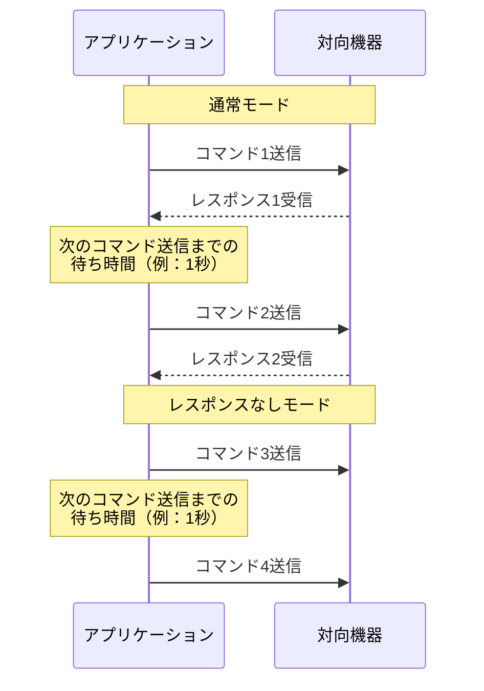
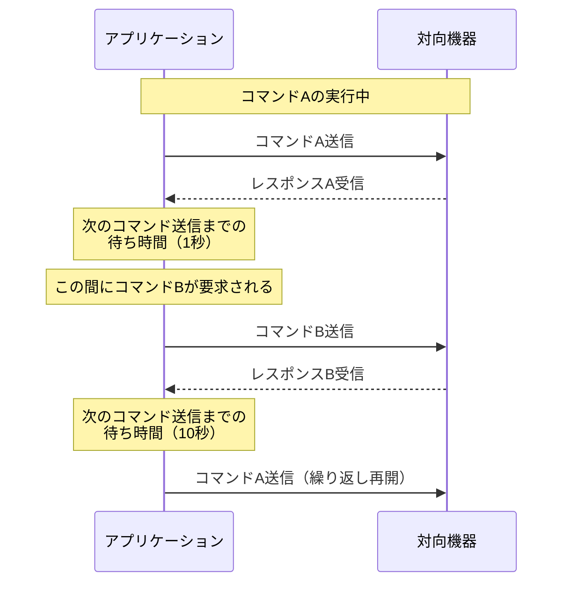
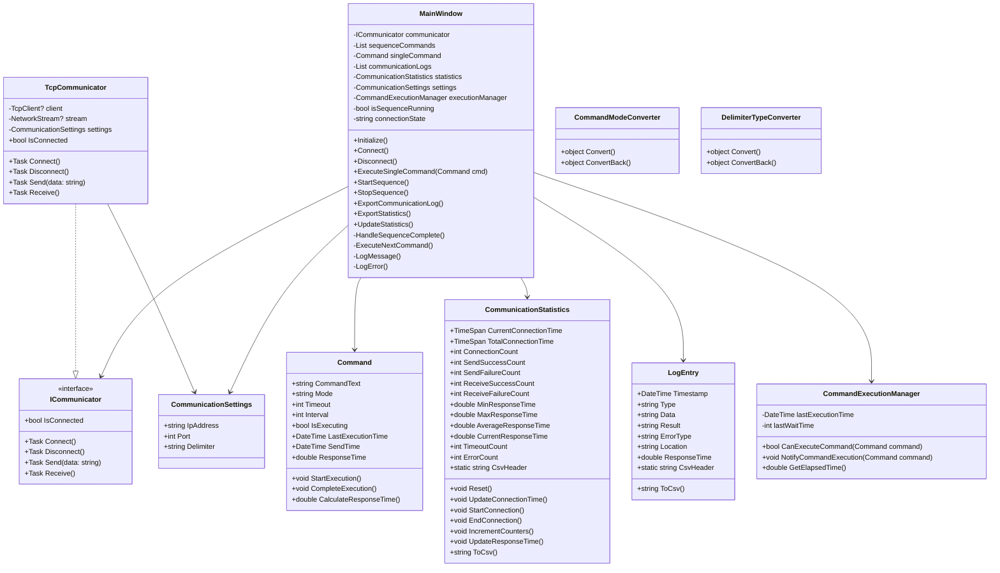

# コマンド送受信アプリケーション 仕様設計書

## 1. システム概要

本アプリケーションは、様々な通信方式を使用してコマンドの送受信を行うWindowsアプリケーションです。
現在はTCP通信を実装済みで、将来的にRS232C通信にも対応予定です。

## 2. 実装状態

### 2.1 ファイル構成
```
CommandTest/
├── App.xaml                     # アプリケーションのエントリーポイント
├── App.xaml.cs
├── AssemblyInfo.cs             # アセンブリ情報
├── MainWindow.xaml             # メインウィンドウのUI定義
├── MainWindow.xaml.cs          # メインウィンドウのロジック
├── Communications/             # 通信関連
│   ├── ICommunicator.cs       # 通信インターフェース
│   └── TcpCommunicator.cs     # TCP通信の実装
├── Models/                     # モデルクラス
│   ├── Command.cs             # コマンド情報
│   ├── CommandModeConverter.cs    # コマンドモード変換
│   ├── CommunicationSettings.cs   # 通信設定
│   ├── CommunicationStatistics.cs # 統計情報
│   ├── DelimiterTypeConverter.cs  # デリミタ変換
│   └── LogEntry.cs                # ログエントリ
└── docs/                      # ドキュメント
    └── specification.md       # 仕様書
```

### 2.2 実装済み機能

#### 2.2.1 通信機能
- TCP通信（クライアントモード）
  - 接続/切断制御
  - 非同期通信処理
  - デリミタ処理（CR/LF/CRLF）
  - エラー処理

#### 2.2.2 送受信モード
- 通常モード
  - コマンド送信後のレスポンス待ち受け
  - タイムアウト制御
  - 応答時間計測（1ms精度）
- コマンドなしモード（受信のみ）
  - データ受信処理
  - タイムアウト制御
- レスポンスなしモード（送信のみ）
  - データ送信処理

#### 2.2.3 実行機能
1. 単発送受信
   - コマンドテキスト入力
   - 送受信モード選択
   - タイムアウト時間設定
   - 次のコマンド送信までの待ち時間設定
   - 実行制御

2. 繰り返し送受信
   - コマンドリスト管理（追加/削除/順序変更）
   - コマンド個別設定
     - コマンドテキスト
     - 送受信モード
     - タイムアウト時間
     - 次のコマンド送信までの待ち時間
   - シーケンス制御（開始/停止）

#### 2.2.4 ログ・統計機能
1. 送受信履歴
   - タイムスタンプ（ミリ秒精度）
   - 送信/受信の区分
   - データ内容
   - 実行結果
   - 応答時間（通常モードのみ、1ms精度）
   - CSV形式エクスポート
   - 履歴クリア

2. 統計情報
   - 接続情報
     - 現在の接続時間（リアルタイム更新）
     - 累計接続時間
     - 接続回数
   - 送受信カウンター
     - 送信成功数/失敗数
     - 受信成功数/失敗数
   - 応答時間統計（通常モードのみ）
     - 最小応答時間（1ms精度）
     - 最大応答時間（1ms精度）
     - 平均応答時間（1ms精度）
     - 現在の応答時間（1ms精度）
   - エラー統計
     - タイムアウト発生数
     - その他エラー発生数
   - CSV形式エクスポート
   - 統計クリア

## 3. 主要機能

### 3.1 通信機能

#### 3.1.1 通信方式
- TCP通信（クライアントモード）
- RS232C通信（将来拡張）

#### 3.1.2 送受信モード
1. 通常モード
   - コマンド送信後、レスポンスを待ち受けて受信
   - タイムアウト時間を設定可能
   - 送信からレスポンス受信までの時間を1ms精度で計測

2. コマンドなしモード
   - 受信のみを行うモード
   - データを継続的に受信

3. レスポンスなしモード
   - 送信のみを行うモード
   - レスポンスを待たずに次の処理へ

### 3.2 送受信方式

#### 3.2.1 単発送受信
- 1つのコマンドを送信し、レスポンスを受信
- レスポンスなしモード時は送信のみ
- コマンドなしモード時は受信のみ

#### 3.2.2 繰り返し送受信
- 複数のコマンドを順次実行
- 各モードでの動作：
  1. 通常モード：レスポンス受信完了後、次のコマンド送信までの待ち時間を経過した後に次コマンドを送信
  2. レスポンスなしモード：コマンド送信完了後、次のコマンド送信までの待ち時間を経過した後に次コマンドを送信
  3. コマンドなしモード：継続的に受信データを監視



### 3.3 設定項目

#### 3.3.1 設定部
1. 通信設定
   - TCP設定
     - IPアドレス
     - ポート番号
   - 接続/切断制御

2. コマンド設定
   - デリミタ設定（CR/LF/CRLF）

#### 3.3.2 コマンド実行部
1. 単発送受信タブ
   - コマンド入力欄
   - タイムアウト時間設定
   - 次のコマンド送信までの待ち時間設定
   - 送受信モード選択
   - 実行ボタン

2. 繰り返し送受信タブ
   - コマンドリスト表示/編集グリッド
     - コマンドテキスト列
     - タイムアウト時間列
     - 次のコマンド送信までの待ち時間列
     - 送受信モード列
   - コマンド追加/削除ボタン
   - 開始/停止ボタン
   - 実行順序の変更機能

#### 3.3.3 送受信制御
1. タイミング制御
   - タイムアウト時間：コマンドごとに個別設定
   - 次のコマンド送信までの待ち時間：コマンド間で一元管理
     - 最後に実行したコマンドの待ち時間が次のコマンド実行を制御
     - 待ち時間はコマンド送受信完了後から計測開始
     - 異なる送受信モード（単発/繰り返し）をまたいだ待ち時間管理
     - 例：コマンドA（繰り返し、次のコマンド送信までの待ち時間1秒）の実行中にコマンドB（単発、次のコマンド送信までの待ち時間10秒）が要求された場合
       1. コマンドAのレスポンス受信完了後、1秒待ってからコマンドBを実行
       2. コマンドBのレスポンス受信完了後、10秒待ってからコマンドAの繰り返し送受信を再開



2. 混在実行制御
   - 繰り返し送受信実行中の単発送信
     - 最後に実行したコマンドの次のコマンド送信までの待ち時間経過後に実行
     - 単発コマンドの次のコマンド送信までの待ち時間経過後に繰り返し再開

### 3.4 ログ・統計機能
1. 送受信履歴の記録
   - タイムスタンプ
   - 送信/受信の区分
   - データ内容
   - 通信結果
   - 応答時間（通常モードのみ、1ms精度）

2. エラー履歴の記録
   - タイムスタンプ
   - エラー種別
   - エラー内容
   - エラー発生箇所

3. 通信統計情報
   - 接続情報
     - 現在の接続時間
     - 累計接続時間
     - 接続回数
   - 送受信統計
     - 送信成功数/失敗数
     - 受信成功数/失敗数
   - 応答時間統計（通常モードのみ）
     - 最小応答時間（1ms精度）
     - 最大応答時間（1ms精度）
     - 平均応答時間（1ms精度）
     - 現在の応答時間（1ms精度）
   - エラー統計
     - タイムアウト発生数
     - その他エラー発生数

4. CSV形式でのエクスポート
   - 送受信履歴のエクスポート
   - エラー履歴のエクスポート
   - 統計情報のエクスポート

## 4. システム設計

### 4.1 クラス設計



### 4.2 クラス説明

#### 4.2.1 MainWindow
- アプリケーションのメインウィンドウを管理
- 通信制御とログ管理を実装
- 単発/繰り返し送受信の制御
- タブ切り替えの管理
- UIイベントの処理
- エラー処理と記録
- 応答時間の計測と統計処理

#### 4.2.2 Command
- コマンド情報の管理
- タイムアウトと待ち時間の個別設定
- 実行状態の管理
- 応答時間の計測

#### 4.2.3 ICommunicator
- 通信機能のインターフェース
- 将来的なRS232C対応のための抽象化
- 基本的な通信操作を定義

#### 4.2.4 TcpCommunicator
- TCP通信の実装
- 非同期通信処理
- デリミタ処理の実装
- 接続状態の管理

#### 4.2.5 LogEntry
- 送受信/エラーログのデータ構造
- タイムスタンプ管理
- 通信結果の記録
- エラー情報の記録
- 応答時間の記録
- CSV形式エクスポート

#### 4.2.6 CommunicationSettings
- TCP通信パラメータの管理
- デリミタ設定の管理

#### 4.2.7 CommunicationStatistics
- 通信統計情報の管理
- 接続時間の計測
- 送受信カウンターの管理
- 応答時間の統計処理
- CSV形式エクスポート

#### 4.2.8 CommandModeConverter
- 送受信モードの表示変換
- 日本語表示とコード値の相互変換

#### 4.2.9 DelimiterTypeConverter
- デリミタ設定の表示変換
- 表示用文字列とコード値の相互変換

## 5. 画面設計

### 5.1 メイン画面レイアウト

#### 5.1.1 設定部
1. 通信設定部
   - 通信方式選択コンボボックス
   - IPアドレス入力欄
   - ポート番号入力欄
   - 接続/切断ボタン
   - 接続状態表示

2. コマンド設定部
   - デリミタ選択（CR/LF/CRLF）

#### 5.1.2 コマンド実行部
1. タブコントロール
   - 単発送受信タブ
     - コマンド入力欄
     - タイムアウト時間設定
     - 次のコマンド送信までの待ち時間設定
     - 送受信モード選択
     - 実行ボタン
   
   - 繰り返し送受信タブ
     - コマンドリスト表示/編集グリッド
     - コマンド追加/削除ボタン
     - コマンド順序変更ボタン
     - 開始/停止ボタン

#### 5.1.3 ログ・統計表示部
1. 統計情報エリア
   - 接続状態表示
     - 現在の接続時間
     - 累計接続時間
     - 接続回数
   - 送受信カウンター表示
     - 送信成功/失敗
     - 受信成功/失敗
   - 応答時間表示（1ms精度）
     - 最小応答時間
     - 最大応答時間
     - 平均応答時間
     - 現在の応答時間
   - エラーカウンター表示
     - タイムアウト数
     - その他エラー数
   - CSVエクスポートボタン

2. 送受信履歴エリア
   - 送受信履歴グリッド表示
     - タイムスタンプ列
     - 送信/受信区分列
     - データ内容列
     - 応答時間列（1ms精度、通常モードのみ）
     - 結果列
   - CSVエクスポートボタン
   - 履歴クリアボタン

## 6. エラー処理

### 6.1 通信エラー
- 接続失敗
- 切断検知
- タイムアウト
- データ送信失敗
- データ受信失敗

### 6.2 ユーザー入力エラー
- 無効な接続パラメータ
- 無効なコマンド形式
- 無効な設定値

## 7. 将来的な拡張性

### 7.1 通信方式の追加
- RS232C通信の実装
- その他の通信プロトコルへの対応

### 7.2 機能拡張
- コマンドテンプレート機能
- マクロ機能
- スクリプト実行機能
- 通信データの解析機能

## 8. 開発環境
- 開発言語：C#
- フレームワーク：.NET 8.0
- UIフレームワーク：WPF
- 開発ツール：Visual Studio 2022
- 対象OS：Windows 10/11
