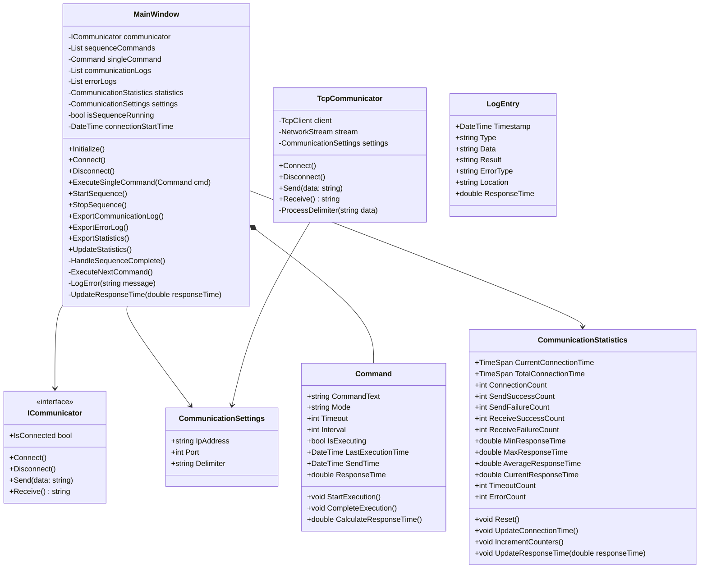

# コマンド送受信アプリケーション 仕様設計書

## 1. システム概要

本アプリケーションは、様々な通信方式を使用してコマンドの送受信を行うWindowsアプリケーションです。
主にTCP通信を使用し、将来的にRS232C通信にも対応予定です。

## 2. 主要機能

### 2.1 通信機能

#### 2.1.1 通信方式
- TCP通信（クライアントモード）
- RS232C通信（将来拡張）

#### 2.1.2 送受信モード
1. 通常モード
   - コマンド送信後、レスポンスを待ち受けて受信
   - タイムアウト時間を設定可能
   - 送信からレスポンス受信までの時間を1ms精度で計測

2. コマンドなしモード
   - 受信のみを行うモード
   - データを継続的に受信

3. レスポンスなしモード
   - 送信のみを行うモード
   - レスポンスを待たずに次の処理へ

### 2.2 送受信方式

#### 2.2.1 単発送受信
- 1つのコマンドを送信し、レスポンスを受信
- レスポンスなしモード時は送信のみ
- コマンドなしモード時は受信のみ

#### 2.2.2 繰り返し送受信
- 複数のコマンドを順次実行
- 各モードでの動作：
  1. 通常モード：レスポンス受信後、待ち時間経過後に次コマンド送信
  2. レスポンスなしモード：コマンド送信後、待ち時間経過後に次コマンド送信
  3. コマンドなしモード：継続的に受信データを監視

### 2.3 設定項目

#### 2.3.1 設定部
1. 通信設定
   - TCP設定
     - IPアドレス
     - ポート番号
   - 接続/切断制御

2. コマンド設定
   - デリミタ設定（CR/LF/CRLF）

#### 2.3.2 コマンド実行部
1. 単発送受信タブ
   - コマンド入力欄
   - タイムアウト時間設定
   - 次コマンドまでの待ち時間設定
   - 送受信モード選択
   - 実行ボタン

2. 繰り返し送受信タブ
   - コマンドリスト表示/編集グリッド
     - コマンドテキスト列
     - タイムアウト時間列
     - 待ち時間列
     - 送受信モード列
   - コマンド追加/削除ボタン
   - 開始/停止ボタン
   - 実行順序の変更機能

#### 2.3.3 送受信制御
1. タイミング制御
   - タイムアウト時間：コマンドごとに個別設定
   - 待ち時間：コマンドごとに個別設定

2. 混在実行制御
   - 繰り返し送受信実行中の単発送信
     - 繰り返しサイクル完了後に実行
     - 単発コマンドの待ち時間経過後に繰り返し再開

### 2.4 ログ・統計機能
1. 送受信履歴の記録
   - タイムスタンプ
   - 送信/受信の区分
   - データ内容
   - 通信結果
   - 応答時間（通常モードのみ、1ms精度）

2. エラー履歴の記録
   - タイムスタンプ
   - エラー種別
   - エラー内容
   - エラー発生箇所

3. 通信統計情報
   - 接続情報
     - 現在の接続時間
     - 累計接続時間
     - 接続回数
   - 送受信統計
     - 送信成功数/失敗数
     - 受信成功数/失敗数
   - 応答時間統計（通常モードのみ）
     - 最小応答時間（1ms精度）
     - 最大応答時間（1ms精度）
     - 平均応答時間（1ms精度）
     - 現在の応答時間（1ms精度）
   - エラー統計
     - タイムアウト発生数
     - その他エラー発生数

4. CSV形式でのエクスポート
   - 送受信履歴のエクスポート
   - エラー履歴のエクスポート
   - 統計情報のエクスポート

## 3. システム設計

### 3.1 クラス設計

### 3.2 クラス説明

#### 3.2.1 MainWindow
- アプリケーションのメインウィンドウを管理
- 通信制御とログ管理を直接実装
- 単発/繰り返し送受信の制御
- タブ切り替えの管理
- UIイベントの処理
- エラー処理と記録
- 応答時間の計測と統計処理

#### 3.2.2 Command
- コマンド情報の管理
- タイムアウトと待ち時間の個別設定
- 実行状態の管理
- 最終実行時刻の記録
- 応答時間の計測

#### 3.2.3 ICommunicator
- 通信機能のインターフェース
- 将来的なRS232C対応のための抽象化
- 基本的な通信操作を定義

#### 3.2.4 TcpCommunicator
- TCP通信の実装
- 非同期通信処理
- デリミタ処理の実装
- 通信状態の管理

#### 3.2.5 LogEntry
- 送受信/エラーログのデータ構造
- タイムスタンプ管理
- 通信結果の記録
- エラー情報の記録
- 応答時間の記録

#### 3.2.6 CommunicationSettings
- TCP通信パラメータの管理
- デリミタ設定の管理

## 4. 画面設計

### 4.1 メイン画面レイアウト

#### 4.1.1 設定部
1. 通信設定部
   - 通信方式選択コンボボックス
   - IPアドレス入力欄
   - ポート番号入力欄
   - 接続/切断ボタン
   - 接続状態表示

2. コマンド設定部
   - デリミタ選択（CR/LF/CRLF）

#### 4.1.2 コマンド実行部
1. タブコントロール
   - 単発送受信タブ
     - コマンド入力欄
     - タイムアウト時間設定
     - 待ち時間設定
     - 送受信モード選択
     - 実行ボタン
   
   - 繰り返し送受信タブ
     - コマンドリスト表示/編集グリッド
     - コマンド追加/削除ボタン
     - コマンド順序変更ボタン
     - 開始/停止ボタン

#### 4.1.3 ログ・統計表示部
1. 統計情報エリア
   - 接続状態表示
     - 現在の接続時間
     - 累計接続時間
     - 接続回数
   - 送受信カウンター表示
     - 送信成功/失敗
     - 受信成功/失敗
   - 応答時間表示（1ms精度）
     - 最小応答時間
     - 最大応答時間
     - 平均応答時間
     - 現在の応答時間
   - エラーカウンター表示
     - タイムアウト数
     - その他エラー数
   - CSVエクスポートボタン

2. 送受信履歴エリア
   - 送受信履歴グリッド表示
     - タイムスタンプ列
     - 送信/受信区分列
     - データ内容列
     - 応答時間列（1ms精度、通常モードのみ）
     - 結果列
   - CSVエクスポートボタン

3. エラー履歴エリア
   - エラー履歴グリッド表示
     - タイムスタンプ列
     - エラー種別列
     - エラー内容列
     - エラー発生箇所列
   - CSVエクスポートボタン

## 5. エラー処理

### 5.1 通信エラー
- 接続失敗
- 切断検知
- タイムアウト
- データ送信失敗
- データ受信失敗

### 5.2 ユーザー入力エラー
- 無効な接続パラメータ
- 無効なコマンド形式
- 無効な設定値

## 6. 将来的な拡張性

### 6.1 通信方式の追加
- RS232C通信の実装
- その他の通信プロトコルへの対応

### 6.2 機能拡張
- コマンドテンプレート機能
- マクロ機能
- スクリプト実行機能
- 通信データの解析機能

## 7. 開発環境
- 開発言語：C#
- フレームワーク：WPF
- 開発ツール：Visual Studio
- 対象OS：Windows 10/11
